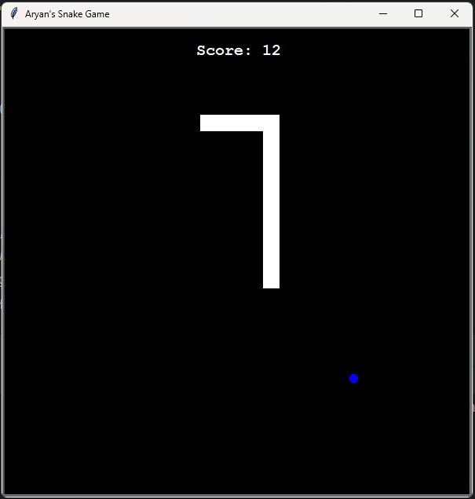
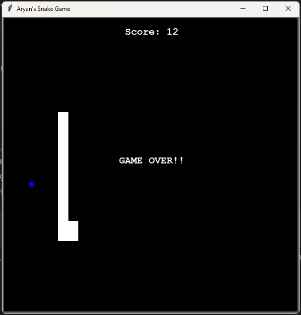

# Python Snake Game


## Description
This is a simple Snake game built using Python and two popular modules: `tkinter` for the GUI and `turtle` for the game mechanics. The game is a classic representation of the Snake game, where the player controls a snake that moves around the board eating food to grow longer. The game ends if the snake runs into the wall or into itself.

## How to Play
To play the game, follow these steps:
1. Clone the repository to your local machine.
   ```
   git clone https://github.com/aryansenpaii/Snake-Game-PY.git
   ```
2. Navigate into the project directory.
   ```
   cd Snake-Game-PY
   ```
3. Run the game by executing `main.py`.
   ```
   python main.py
   ```
4. Use the arrow keys to control the snake (up, down, left, right).

## Features
- Simple and intuitive gameplay.
- Score tracking.
- Snake grows longer as it eats food.
- Game over when the snake runs into itself or the wall.

## Requirements
- Python 3.x
- `tkinter` module (usually comes with Python installation)
- `turtle` module

## Screenshots



## Contributing
Contributions are welcome! Please feel free to fork the repository and submit pull requests.

## License
This project is licensed under the MIT License - see the [LICENSE](LICENSE) file for details.

---
